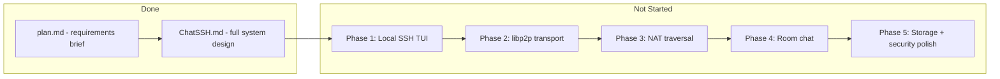
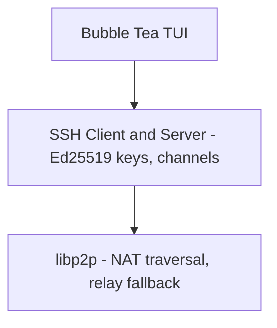

# Understanding the DesignSystem Assignment

## What You Were Asked To Do

The assignment lives in [`DesignSystem/plan.md`](DesignSystem/plan.md). It asks you to **design** (not necessarily build yet) a terminal chat application with these requirements:

| Requirement | Meaning |
|---|---|
| **Terminal chat over SSH** | Users chat in the terminal; transport uses the SSH protocol |
| **Connect via IP worldwide** | Two users anywhere can connect when both run the app and one enters the other's IP |
| **Local storage OR erase forever** | User chooses: persist messages locally, or ephemeral "ghost" mode with no disk writes |
| **E2E encryption** | Messages must be encrypted; intermediaries cannot read content |
| **Room Chat (group)** | One user can host a public room; others join with a shared ID/IP |

The deliverable specified in the brief:

> Create a `ChatSSH.md` file including all necessary tech stack and flow of building this.

That deliverable **already exists** at [`DesignSystem/ChatSSH.md`](DesignSystem/ChatSSH.md).

---

## What Has Been Completed



**Current repo state:** Only the two markdown files above exist. There is no `go.mod`, no source code, no `README`, and no tests. Git history shows a single initial commit pushing these design docs to `https://github.com/BRO-CODES-HERE/OpenChat.git`.

---

## What ChatSSH.md Specifies

### Architecture (3 layers)



1. **Terminal UI** — `charmbracelet/bubbletea` + `lipgloss` (split view: chat feed + input)
2. **SSH layer** — `golang.org/x/crypto/ssh` for handshake, auth, encrypted channels
3. **Network layer** — `go-libp2p` for hole punching (AutoNAT/DCUtR), DHT address discovery, Circuit Relay v2 fallback

### Connection flow (high level)

1. Both peers start the app; libp2p discovers each peer's public IP/port
2. User A enters User B's IP
3. libp2p attempts direct hole punching; falls back to encrypted relay if NAT blocks direct path
4. SSH handshake runs over the libp2p stream (relay sees only encrypted frames)
5. Users verify host-key fingerprints (randomart/emoji) to prevent MITM
6. Chat session opens on an SSH interactive channel

### Non-negotiable features from the brief

- **Storage choice at session start:**
  - **Option A:** SQLite + SQLCipher (passphrase-derived AES-256 key)
  - **Option B:** Ghost Mode — RAM-only, memory scrubbed on exit
- **Room Chat:** Star topology — one peer hosts a multiplexed SSH server; others connect as clients; host broadcasts messages to all channels

### Planned tech stack

| Component | Library |
|---|---|
| Language | Go |
| P2P / NAT | `go-libp2p` |
| SSH | `golang.org/x/crypto/ssh` |
| TUI | `charmbracelet/bubbletea`, `charmbracelet/lipgloss` |
| Storage | `modernc.org/sqlite` + SQLCipher |

---

## Implementation Roadmap (from ChatSSH.md Section 7)

If you move from design to code, the design doc prescribes this order:

### Phase 1 — Local SSH TUI prototype
- Bubble Tea split-screen chat UI
- Local SSH server on a fixed port (e.g. `2222`)
- Verify with `ssh localhost -p 2222`

### Phase 2 — P2P SSH transport
- Initialize libp2p hosts
- Wrap libp2p streams as `net.Conn`
- Feed wrapped connections into SSH client/server

### Phase 3 — NAT traversal
- AutoNAT + DCUtR hole punching
- Bootnodes for address lookup
- Circuit Relay v2 for symmetric NAT fallback

### Phase 4 — Room chat
- Multiplexed SSH server on room host
- Broadcast incoming messages to all connected peers

### Phase 5 — Storage and security polish
- SQLCipher local logs
- Ghost Mode with memory zeroing
- Host-key fingerprint verification UI

---

## Assignment Status Summary

| Item | Status |
|---|---|
| System design document (`ChatSSH.md`) | Complete |
| Tech stack documented | Complete |
| Build flow / phases documented | Complete |
| Go project scaffold | Not started |
| Any runnable application | Not started |

**In short:** The *design assignment* from `plan.md` is fulfilled. The *engineering assignment* — building ChatSSH in 5 phases — has not begun.

---

## Suggested Next Step (when you are ready to implement)

Start **Phase 1** only: scaffold a minimal Go module and prove the local loop — Bubble Tea TUI + local SSH server on `localhost`. That validates the core UX and SSH channel plumbing before adding libp2p complexity.

Proposed initial file layout (not yet created):

```
OpenChat/
├── cmd/chatssh/main.go
├── internal/tui/          # Bubble Tea models
├── internal/sshserver/      # Local SSH server
├── go.mod
└── README.md
```

Phase 1 should **not** include libp2p, NAT traversal, room chat, or SQLCipher — those come in later phases per the design doc.
